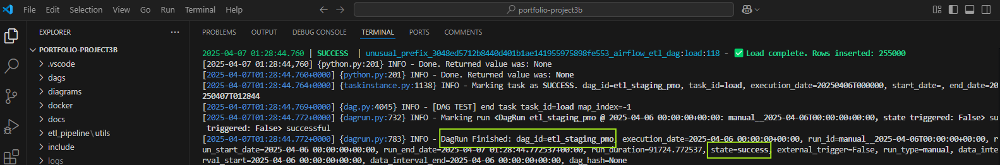

# Project 3B: Apache Airflow DAG Automation

## 🎯 Project Objective
Automate a modular ETL pipeline using **Apache Airflow**, with support for:
- DAG scheduling and orchestration
- Task modularization (Extract, Validate, Transform, Load)
- Logging, retries, and error handling
- Integration with PostgreSQL, APIs, and future cloud targets

---

## 🛠️ Tech Stack
- **Apache Airflow** (Docker-based)
- **Python 3.11**
- **PostgreSQL**
- **Docker & Docker Compose**
- **pandas, SQLAlchemy, psycopg2**
- **pytest** (unit testing)
- **loguru** (logging)
- **dotenv** (secrets management)

---

## 📁 Project Structure (Key Folders)
| Folder        | Purpose                                         |
|---------------|--------------------------------------------------|
| `dags/`       | Production DAGs (TaskFlow API)                  |
| `docker/`     | Airflow Docker setup & volume configs           |
| `include/`    | Shared SQL files, templates, scripts            |
| `sandbox/`    | Temporary debug and connection test scripts     |
| `tests/`      | Unit tests for DAG components                   |
| `logs/`       | Airflow and custom task logs                    |

---

## 🔐 Secrets Management
Secrets are stored in a `.env` file and are **never committed** to version control.
This project uses `python-dotenv` to load environment variables securely.

---

## 🚀 Deployment (Docker Quick Start)
```bash
docker compose up airflow-init
docker compose up
```

## ✅ Apache Airflow DAG Test via CLI (Succesful Run)

> Command tested:
```bash
docker compose exec airflow-webserver airflow dags test etl_staging_pmo 2025-04-05


✔️ extract     → 255,000 rows loaded
✔️ transform   → Columns renamed, 0 nulls dropped, 255,000 rows cleaned
✔️ load        → Loaded to staging table: etl.staging_pmo
✅ DAGRun Finished: state=success

```

### Screenshot: Airflow DAG CLI Test

**Command tested:**


**All Tasks Completed Successfully**


**Load Task Completed Successfully**



## 🚀 DAG Execution Demo

This DAG orchestrates an ETL pipeline that:

- ✅ Extracts 255,000 rows from a raw `.csv` file
- 🔁 Transforms the data (renaming columns, dropping nulls)
- ⬇️ Loads it into a `PostgreSQL` staging schema (`etl.staging_pmo`)
- Uses Python `@task` decorators, `loguru` logging, and modular utils

### DAG Run Snapshot:


> ✔️ All tasks completed successfully with modular design and robust error handling

### DAG Run GIF Demo:


